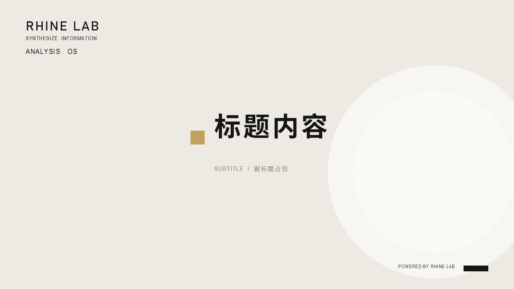
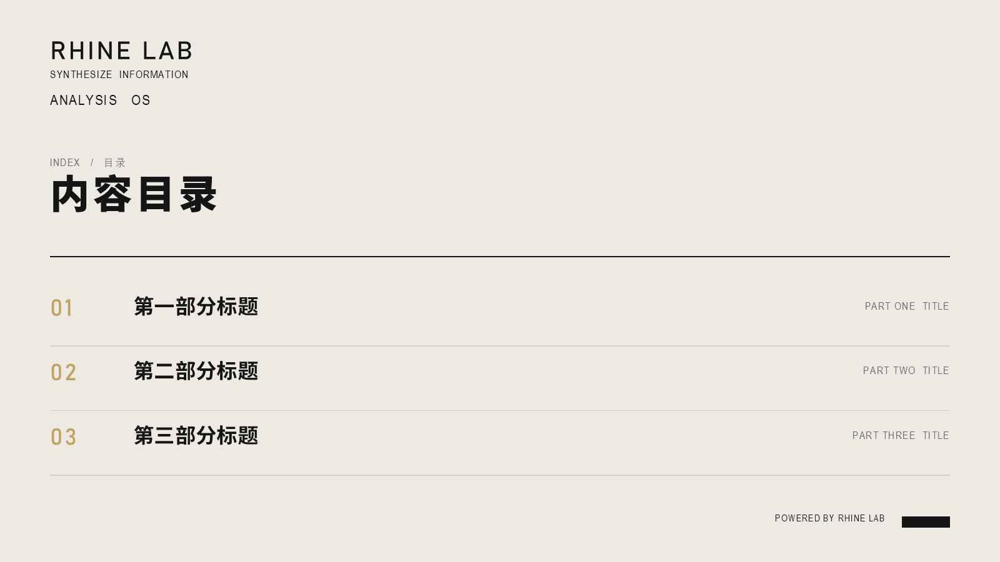
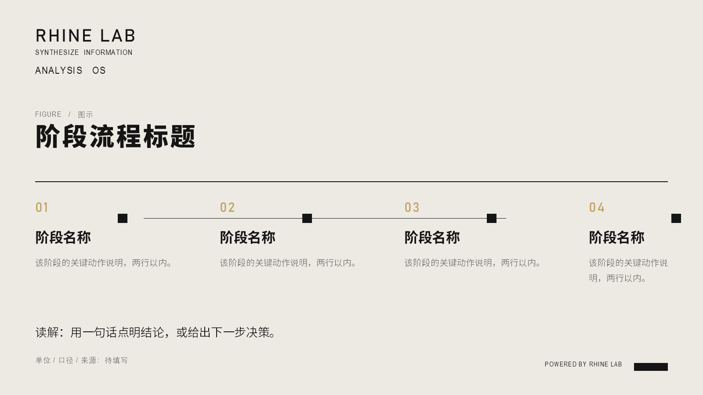
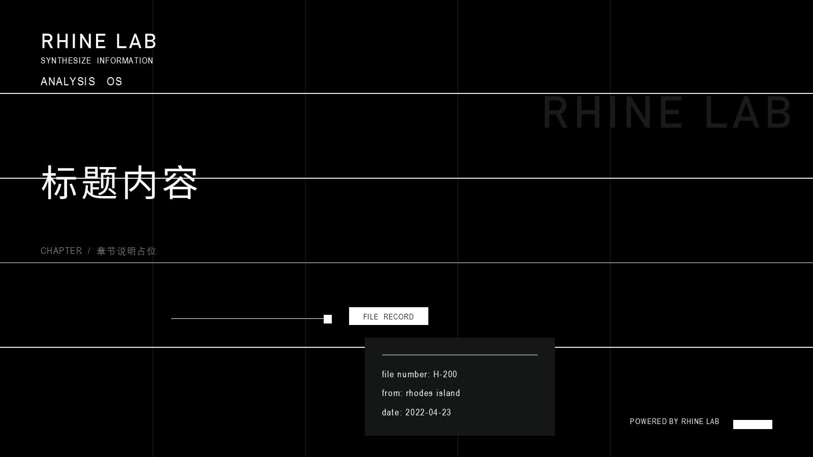
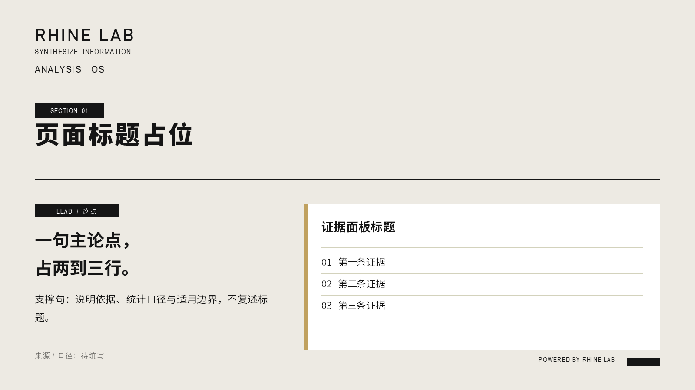
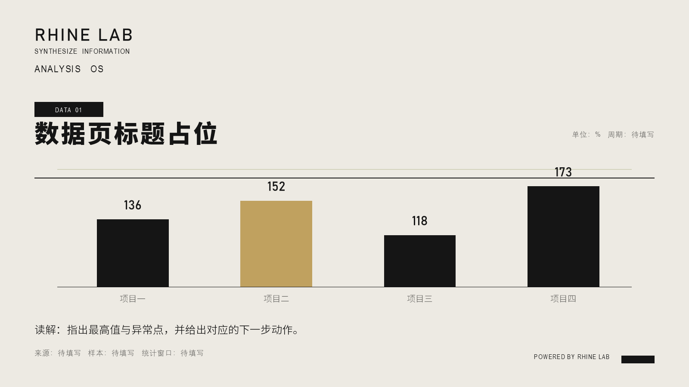
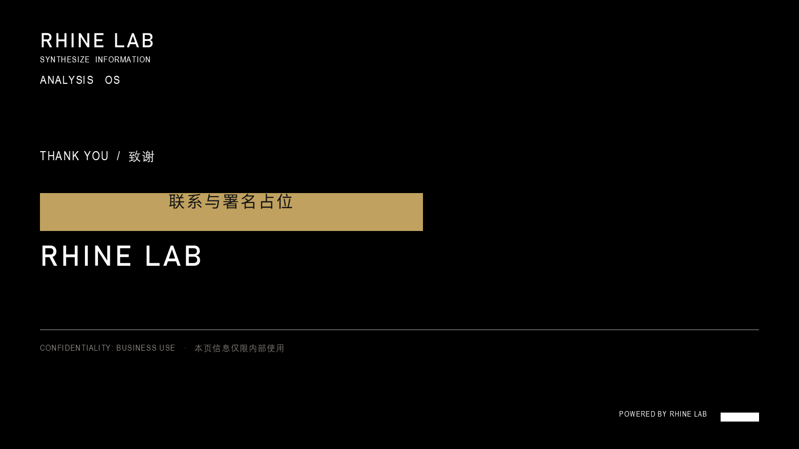

 rhine-lab-ppt

**莱茵生命（RHINE LAB）风格的 PPT 生成技能** —— 一套让 AI Agent 直接产出「科研机构内部档案感」演示文稿的设计系统与渲染器。

从一个 14 页的原始模板逐页拆解出配色、字体栈、网格与版式骨架，固化成可复用的技能包：改内容 JSON，出可编辑 PPTX。



---

## 这套风格长什么样

- **暖象牙纸面**（`#EDEAE3`）打底，**墨黑**（`#151515`）承载信息
- **香槟金**（`#C0A15F`）每页只出现一次，用来点序号或唯一重点
- **宽字距**是灵魂：小标签字距 1.4–3，中文标题字距 2–3
- **发丝线 + 方块节点**建立秩序，不用圆角、不用渐变、不用阴影、不用图标库
- 深场页（`#0B0B0C`）配超细网格与幽灵字，承担章节分隔

克制、精密、留白。适合汇报、竞选、答辩、项目总结、数据读解。

## 七个版式

| | |
|---|---|
|  |  |
| **agenda** 目录：金序号 + 中文标题 + 右对齐英文 | **process** 阶段流程：方块节点 + 横贯细线 |
|  |  |
| **dark** 深场章节页：细网格 + 档案卡 | **statement** 论点页：左论点 + 右证据面板 |
|  |  |
| **data** 数据页：单色柱，仅一根金色强调 | **closing** 结尾：金色横条承载署名 |

另有 `statement-image`（左图右论点）、`photos`（多图作品墙）、`statement-photo`（深场全宽大图）三个含图片的版式。

## 安装

作为 DSH 技能安装（用户级，对当前用户所有会话生效）：

```powershell
git clone https://github.com/Planeer-starry/rhine-lab-ppt.git
cd rhine-lab-ppt
powershell -ExecutionPolicy Bypass -File scripts/install-skill.ps1
```

或手动复制到任一技能根目录：

| 作用域 | 路径 |
|---|---|
| 用户级 | `<dshHome>/skills/rhine-lab-ppt`（Windows 通常为 `%APPDATA%\dsh-desktop\harness\skills`） |
| 项目级 | `<项目根>/.dsh/skills/rhine-lab-ppt` |

> 技能规范：目录包 `<name>/SKILL.md`，YAML frontmatter 至少含 `name` 与 `description`。

## 使用

### 方式一：改 JSON 出片（推荐）

```powershell
# 1. 复制并编辑内容
Copy-Item templates/content.example.json my-content.json

# 2. 渲染
$env:RHINE_CONTENT = "$PWD\my-content.json"
$env:RHINE_PPTX    = "$PWD\my-deck.pptx"
$env:RHINE_PNG     = "$PWD\my-preview"      # 可选：逐页预览图
$code = [IO.File]::ReadAllText("$PWD\scripts\rhine-style.ps1", [Text.Encoding]::UTF8)
Invoke-Expression $code
```

产出：可编辑 `.pptx`（原生形状与文本框，无图片化、无锁定图层）+ 全部页面 PNG。

内容 JSON 的 `layout` 可选：`cover` / `agenda` / `process` / `dark` / `statement` / `statement-image` / `photos` / `statement-photo` / `data` / `closing`。

### 方式二：母版手动续写

打开 `templates/rhine-lab-master.pptx`（或双击 `.potx` 新建），复制任意一页作起点，替换文字即可。

## 环境要求

- **Windows + PowerPoint**（渲染走 PowerPoint COM）
- **PowerShell 5.1+**
- 图片路径务必使用**纯 ASCII 绝对路径**（含中文或空格会让 Office COM 导入失败）

## 仓库结构

```
rhine-lab-ppt/
├── SKILL.md                      # 技能入口：给 Agent 的操作指令
├── references/
│   └── design-tokens.md          # 完整色值 / 字体栈 / 网格 / 逐版式坐标
├── scripts/
│   ├── rhine-style.ps1           # 渲染器：内容 JSON → PPTX + 预览图
│   └── install-skill.ps1         # 安装到 DSH 技能目录
├── templates/
│   ├── rhine-lab-master.pptx     # 7 页可编辑母版
│   ├── rhine-lab-master.potx     # 同上的 PowerPoint 模板格式
│   └── content.example.json      # 内容示例与字段说明
└── docs/preview/                 # 各版式效果图
```

## 设计纪律

1. **一页一个论点**：主张放标题，主展示占主导，结尾给一句读解或下一步。
2. **数据必须有口径**：单位、样本、统计窗口写在图旁或来源注。
3. **只高亮一个重点**：一根金柱、一个金序号、一条金强调条。
4. **不虚构**：占位保留「待填写」，示例数据显式标注。
5. **不压字号**：中文正文 12–16pt，最小 9pt；塞不下就换版式或拆页。

## 已知注意点

- 渲染器依赖 PowerPoint COM，只能在 Windows 上跑；非 Windows 环境可用 `templates/` 里的母版手动排版。
- 图片按目标框比例做**像素级预裁**再等比缩放，不会拉伸变形；`cropBias` 控制裁切重心（`0.3` 保头部，`0.5` 居中）。
- 原模板中的 `FFFF00` / `92D050` / `00FF00` 是编辑占位提示色，**不是设计色**，技能中已明确禁用。

## License

本仓库采用**拆分许可**，详见 [LICENSE](LICENSE)：

| 部分 | 许可 |
|---|---|
| `scripts/` 代码（渲染器、安装、推送） | **MIT** — 随便用，保留署名即可，含商用 |
| `references/` `templates/` `docs/` `SKILL.md` `README.md` | **CC BY-NC 4.0** — 可自由使用与演绎，须署名、**不得商用** |

### 为什么设计资产不是 MIT

本仓库的设计语言是从一份**玩家仿作**的《莱茵生命 RHINE LAB》PPT 模板中拆解提炼的，
其风格原型出自游戏《明日方舟》中的虚构组织「莱茵生命」。
对自己写的代码我授予 MIT，但对**从第三方模板提炼的设计资产**不作商用授权 —— 这是
CC BY-NC 4.0 用在这里的原因。

若你是原始模板作者并认为本仓库的使用方式不当，请开 Issue，我们会立即调整或移除。

